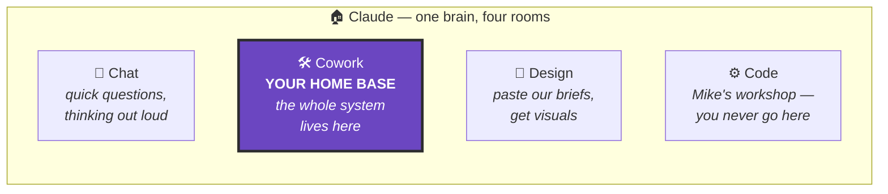
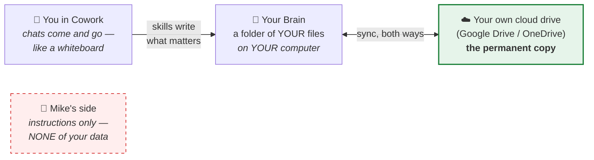
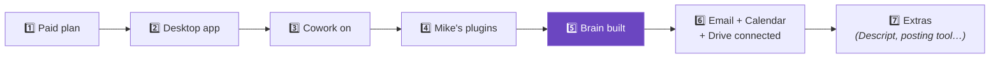
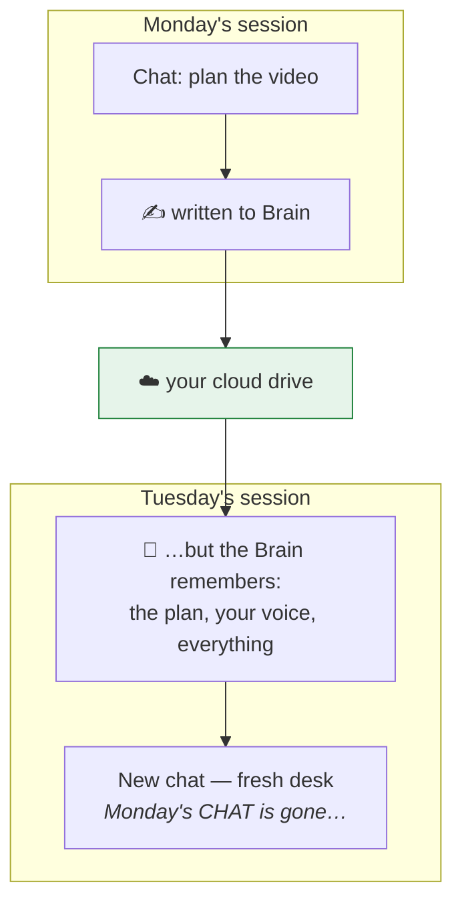
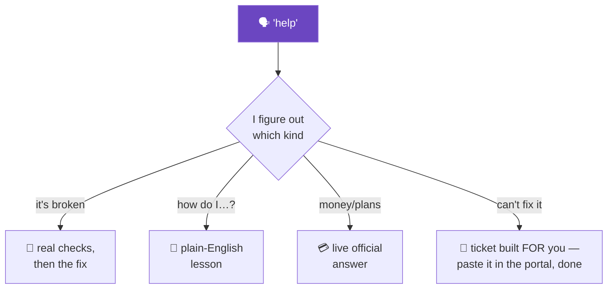

# Visual Aids — pre-scripted diagrams support can SHOW

Some members are picture people: a 10-second diagram lands where three paragraphs bounce. These
are pre-scripted Mermaid diagrams — render them inline in chat when teaching (Cowork draws them
as real diagrams). Rules: **one diagram per reply** · always with a one-line caption in plain
words · use the scripts as written (tested layouts; tweak labels only, e.g. swapping "Google
Drive" for "OneDrive" to match the member's provider) · never diagram what a sentence explains
faster.

When to reach for one: the four-rooms confusion (Chat vs Cowork vs Design) · "where does my data
live" worry · the setup chain ("what's left?") · "why did my chat disappear" · "what happens when
I say help." Offer, don't force: *"Want the 10-second picture version?"*

## 1. The four rooms (Chat vs Cowork vs Design vs Code)

Caption: *"Thought → Chat. Thing → Cowork. Visual → Design. And Code is where we build your
tools — you never need it."*

## 2. Where your stuff actually lives (the trust picture)

Caption: *"Chats are whiteboards. Your Brain is the filing cabinet, and the permanent copy sits
in YOUR cloud drive. Nothing of yours lives on our side."*

## 3. The setup chain (used by the onboard audit)

Caption: *"Seven links, in order — I check them top to bottom and we fix the FIRST broken one,
never all seven at once."* (Mark the member's current position when rendering: add ✅ to passed
links, 👉 to the next one.)

## 4. Why your chat "disappeared" (nothing is lost)

Caption: *"Chats are workdays; the Brain keeps the memory. New day, fresh desk, same
filing cabinet."*

## 5. What happens when you say "help"

Caption: *"One word in — the right kind of help out. Worst case, a human gets a perfect ticket
you didn't have to write."*

## Beyond these five

- **Member screenshots IN** are still the best visual channel — ask early, annotate verbally
  ("see the button on the top right of your screenshot?").
- A member who wants a **keep-forever cheat sheet** (the four rooms + the one phrase) → that's a
  one-page artifact; offer it at the end of a teach session, never mid-fix.
- Don't freehand new diagrams mid-session for concepts these five already cover; consistency IS
  the pedagogy. A genuinely new diagram need → log it (that's a candidate for this file's next
  release).
